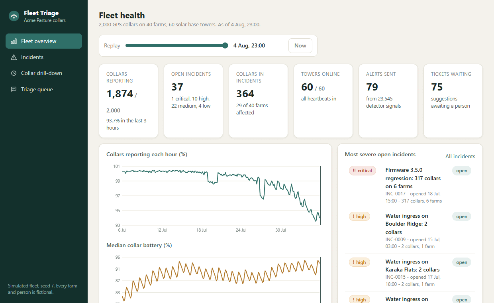
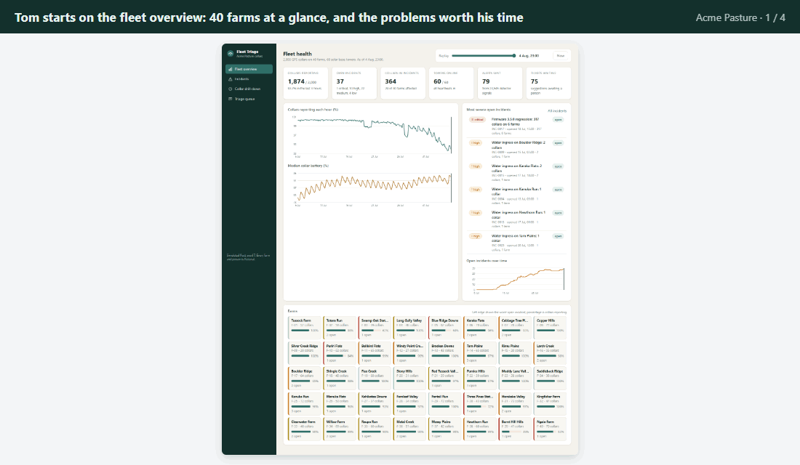
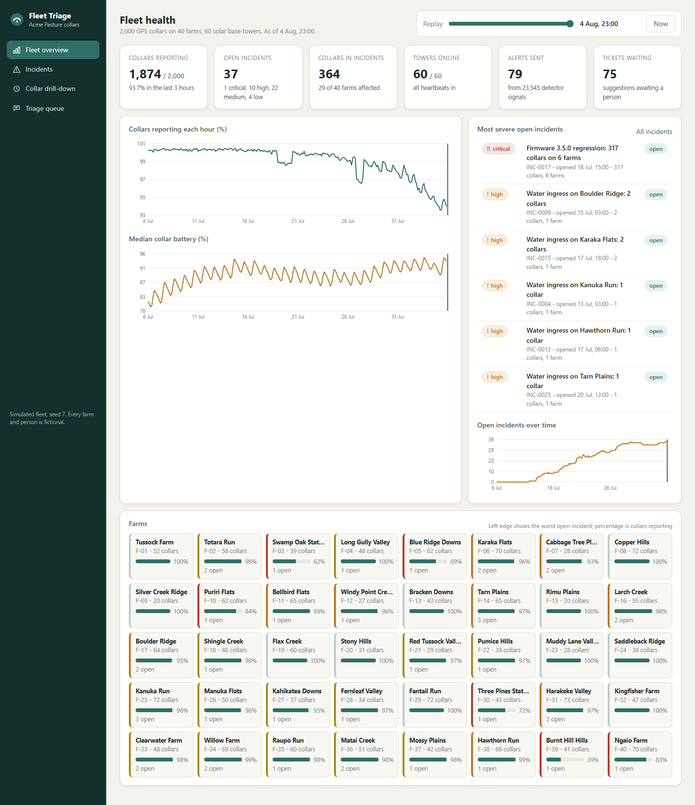
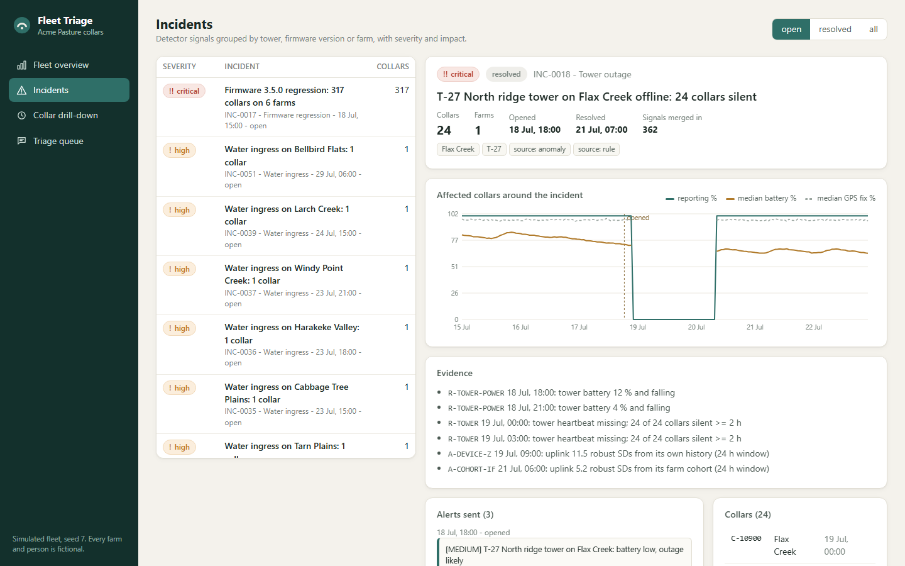
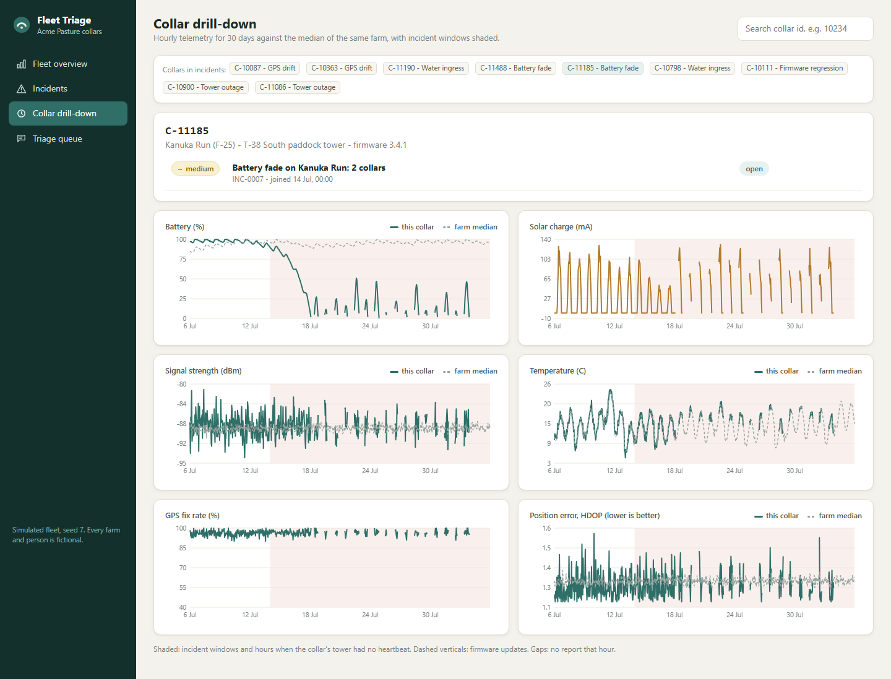
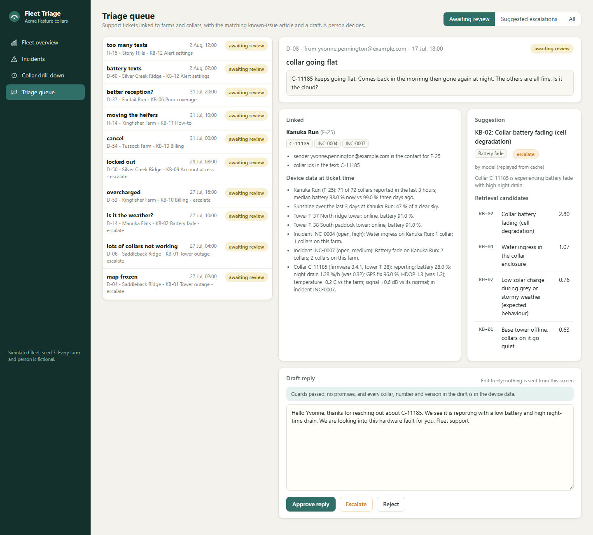
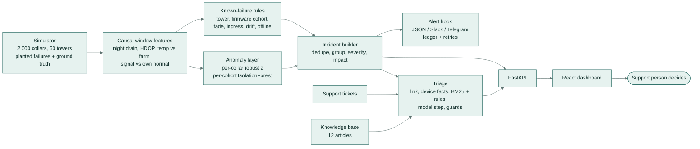
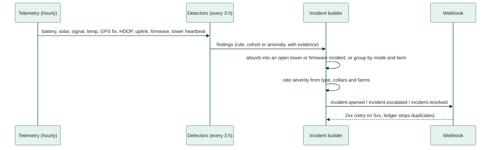
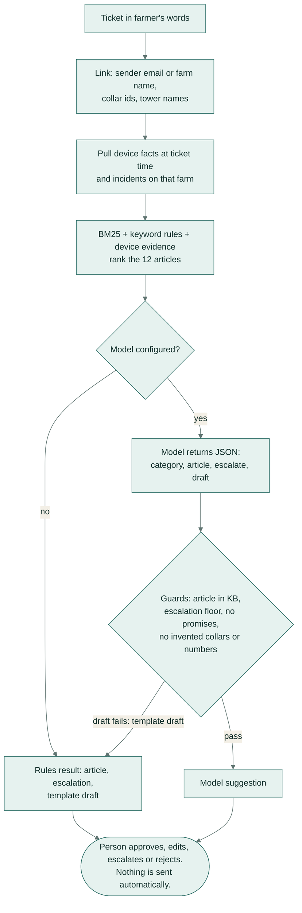

# Fleet Triage



*A short recording of the dashboard: winding the clock forward to a storm, opening the tower that went down, looking
at one collar's battery history, and passing a farmer's ticket to a specialist.*

## What it does

Farmers put GPS collars on their cattle so they can see where the herd is from their phone. The collars talk to
solar-powered radio towers on each farm. This project watches thousands of collars and towers, spots the ones that
are failing before the farmer notices, and helps the support team answer farmers' messages with the right
explanation. A person makes every decision.

## A real-life example

Tom works on the support desk at Acme Pasture, which makes the collars. Its customers have 2,000 collars on 40 farms.

**Before:** after a storm, simple low-battery and no-signal alarms go off for hundreds of collars at once. Over a
month that is close to a thousand alarms, and they fire for a hilly farm where nothing is actually wrong. Then the
messages arrive. Yvonne writes: "C-11185 keeps going flat. Comes back in the morning then gone again at night. Is it
the cloud?" Tom has to dig through the collar's data and the help articles to work out whether it is the weather,
the tower, a software update or a worn-out battery.

**With Fleet Triage:**
1. The overview shows every farm, how many collars are reporting and the problems open right now.
2. Thousands of warning signs are grouped into a short list of real problems, such as "the tower on Flax Creek is
   down, 24 collars silent", each with how serious it is and how many farms it affects.
3. Yvonne's message is already linked to her farm and her collar. The app shows the collar's recent readings,
   suggests the matching help article (here: the battery is wearing out) and drafts a reply for Tom to edit.
4. Tom approves the reply, edits it, or passes the ticket to a specialist. Nothing is sent by the app.

**After:** in testing on a month the system had never seen, it found every planted fault and named it correctly,
with one healthy collar flagged by mistake. A tower that went down was spotted in a median of 3 hours. Simple
alarms fired 988 times that month; Fleet Triage sent 79 notifications. On the support side it suggested the right
help article for all 15 test messages.



*Tom's morning in four steps, from real screens of the dashboard: the whole fleet at a glance, a tower outage shown
as one problem, Yvonne's message with a suggested answer, and the battery chart that explains it.*

## How you would use it

1. Open the dashboard in your web browser.
2. **Fleet overview:** check how many collars are reporting and which farms have a problem. Drag the replay slider
   to see any hour of the last 30 days.
3. **Incidents:** click a problem to see which collars and farms it affects, a chart of what happened, and the
   alerts that were sent.
4. **Collar drill-down:** type a collar number to see its battery, solar charge, signal and GPS readings next to the
   rest of its farm.
5. **Triage queue:** open a farmer's message, read the suggested article and draft, then click approve, escalate or
   reject.

The technical setup is further down.

## Overview

Monitoring, failure detection and support triage for a fleet of GPS livestock collars and solar base towers.
It replays 30 days of hourly telemetry (the readings each device sends home) from 2,000 collars on 40 farms,
finds the known failure modes, groups thousands of detector signals into a few dozen incidents with severity and
impact, sends them to a webhook (a web address that receives alerts, for example a chat channel), and helps a
support person answer farmers' tickets with the device data, the matching known-issue article and a draft reply.
A person makes every decision.

## What it is for

Field operations teams that run a connected-device fleet need to spot device and tower problems before
customers do, judge how bad each one is, keep a knowledge base of known issues, and turn "half my herd's collars
went quiet after the storm" into a linked, evidenced ticket. This project is that toolchain for an invented
collar maker, **Acme Pasture**, with every number measured against planted ground truth.

**Key features**

- **Seeded fleet simulator** (realistic made-up data that comes out the same every run): 2,000 collars, 60 solar towers, weather, firmware rollouts and six planted
  failure modes with ground truth (device ids, start time, type), including a noisy-but-healthy farm that
  exists only to count false positives.
- **Detection**: rules for the known failure modes, per-collar robust z-scores (how far a reading is from that
  collar's own normal) and a per-cohort IsolationForest (a method that spots collars behaving unlike their
  neighbours), all computed causally so every alert has a realistic time to detect.
- **Incidents, not alert storms**: one incident per tower outage, per firmware version or per failure mode per
  farm, with severity, collars and farms affected. 23,500 detector signals become 55 incidents and 79
  notifications.
- **Alert hook**: incident notifications to any webhook in JSON, Slack or Telegram format, deduplicated by a
  ledger and retried on failure. A mock receiver is built in.
- **Triage assistant**: 75 farmer-written tickets linked to farms and collars, device facts pulled at ticket
  time, BM25 (keyword search ranking) plus rules retrieval over 12 known-issue articles, an optional model step (an AI language model) with structured JSON
  output (answers in a fixed, machine-readable form), and guards against promises and invented device facts.
- **Dashboard**: FastAPI backend and a React + TypeScript dashboard with a fleet overview you can replay to any
  hour, incidents with evidence and alerts, collar drill-down charts and the triage queue.
- **Evaluation**: detection precision (how many alerts were real), recall (how many real faults were found) and
  time to detect per failure mode on a development seed and a
  held-out seed; triage accuracy on 60 development and 15 held-out tickets.

## Screenshots

| Fleet overview | Incidents |
|---|---|
|  |  |
| The whole fleet at a glance: collars reporting, open problems, battery trends and a tile per farm. | One tower outage: 24 collars went quiet, the chart of what happened, the evidence and the alerts sent. |
| **Collar drill-down** | **Triage queue** |
|  |  |
| One collar against its farm's average: the battery falls away every night, the sign of a worn battery. | A farmer's message linked to her farm and collar, the suggested help article and a reply to edit. |

## Architecture



## Main flows

From telemetry to an alert:



From a ticket to a decision:



## How it works

1. **Simulate.** `simulate(seed)` builds 40 farms in four regions, 60 towers and 2,000 collars, then runs 720
   hours. Collars charge from a small solar panel and drain overnight; towers do the same with a bigger battery.
   Weather varies by region and one region gets a three-day storm. Failures are planted on disjoint collars:
   battery fade (capacity loss and rising self-discharge), tower outages (storm-flattened towers and one backhaul
   fault), firmware 3.5.0 rolled out in stages to six farms (drain x1.7, GPS fix -17 points), water ingress
   (hot and weak, then dead), GPS drift (HDOP climbing over days) and one hill farm with weak, noisy coverage that
   is healthy. A harmless firmware 3.4.2 rollout is a decoy for the cohort check.
2. **Compute features causally.** Every 3 hours the detectors read only data from earlier hours: night-time
   battery drain, GPS fix rate, HDOP, temperature against the farm median at the same hour, signal against the
   collar's own normal, uplink rate and solar charge against the farm.
3. **Apply the known-failure rules** (each one maps to a knowledge-base article):

   | Rule | Fires when | Article |
   |---|---|---|
   | R-TOWER | tower heartbeat missing 2 h, or 60% of its live collars silent 2 h | KB-01 |
   | R-TOWER-POWER | tower battery under 15% and falling (early warning) | KB-01 |
   | R-FIRMWARE | collars that moved to a version: paired before/after median drain +0.08 %/h or fix -6 points, with 65% of collars worse | KB-03 |
   | R-FADE | 72 h night drain above 0.5 %/h and 1.5x the collar's own earlier level, firmware unchanged for 7 days | KB-02 |
   | R-INGRESS | 6 h temperature 3 C above the farm and signal 4 dB below its own normal | KB-04 |
   | R-DRIFT | 24 h HDOP above 2.8 and 1.0 above its level a few days earlier | KB-05 |
   | R-OFFLINE | no report for 8 h while the collar's tower is up | - |

4. **Run the anomaly layer.** A robust z-score of each feature against the collar's own history (days 2 to 7
   back) catches slow drifts early; an IsolationForest over farm-standardised residuals, fitted on the first
   days, catches collars that differ from their own farm. A flag needs two consecutive checks and is labelled
   with the feature that moved most, which maps to a suspected failure mode.
5. **Build incidents.** Findings are routed in time order. Collars that go quiet on a tower that is down join the
   tower incident; a power warning that turns into an outage stays the same incident and escalates. Drain and
   GPS-fix signals on collars in an open firmware incident are merged into it, and anomaly signals on a collar
   whose firmware changed in the last 72 hours wait for the cohort check. Everything else groups by failure mode
   and farm. Severity comes from the type, the number of collars and the number of farms, and only rises while
   the incident is open.
6. **Notify.** Each opened, escalated or resolved incident becomes one payload, rendered as JSON, Slack blocks or
   a Telegram message. A ledger keyed on incident, event and severity makes sending idempotent across restarts.
7. **Triage tickets.** The sender's email (or a farm name in the text) gives the farm; collar ids and tower names
   are read from the text and checked against the registry. Device facts are pulled at the ticket's arrival
   time. BM25 ranks the 12 articles, keyword rules add weight, and the device evidence adds the most: a collar
   whose night drain tripled points to battery fade even when the farmer asks "is it the cloud?". The model
   step sees the ticket, the facts and the top five candidates and returns JSON. Guards check the article id,
   force escalation when a high or critical incident is linked to a hardware fault, and reject drafts that
   promise fixes, refunds, dates or time frames, or that mention a collar, tower, version or number that is
   not in the facts. A rejected draft is replaced by the rules template.
8. **Decide.** The dashboard shows the suggestion and an editable draft. Approve, escalate and reject are
   recorded; nothing is sent from the dashboard.

## Results

All numbers come from `results/` and are reproduced by the commands in [Evaluation](#evaluation). Seed 7 is
the development seed that thresholds were tuned on. Seed 2026 is held out and was never tuned on.

### Detection

| Seed | Method | Recall | Precision | False-positive collars | Noisy farm flagged | Alerts to on-call |
|---|---|---|---|---|---|---|
| 7 (dev) | Threshold baseline | 72.2% | 78.7% | 84 | 72 of 72 | 1,175 |
| 7 (dev) | Rules | 100.0% | 100.0% | 0 | 0 of 72 | 47 |
| 7 (dev) | Rules + anomaly (shipped) | 100.0% | 99.8% | 1 | 1 of 72 | 79 |
| 2026 (held out) | Threshold baseline | 65.0% | 78.6% | 74 | 56 of 56 | 988 |
| 2026 (held out) | Rules | 100.0% | 99.8% | 1 | 0 of 56 | 52 |
| 2026 (held out) | Rules + anomaly (shipped) | 100.0% | 99.8% | 1 | 0 of 56 | 79 |

Per failure mode on the held-out seed (recall / flagged with the right type / median hours from failure start to
first flag):

| Failure mode | Collars | Threshold baseline | Rules | Rules + anomaly |
|---|---|---|---|---|
| Tower outage | 63 | 100% / 0% / 6 h | 100% / 100% / 3 h | 100% / 100% / 3 h |
| Firmware 3.5.0 | 302 | 52% / 0% / 294 h | 100% / 100% / 17 h | 100% / 100% / 17 h |
| Battery fade | 25 | 100% / 100% / 212 h | 100% / 100% / 116 h | 100% / 100% / 104 h |
| Water ingress | 12 | 100% / 67% / 28 h | 100% / 100% / 6 h | 100% / 100% / 6 h |
| GPS drift | 15 | 100% / 100% / 116 h | 100% / 100% / 59 h | 100% / 100% / 34 h |

What the numbers say:

- Static thresholds page 988 times for 30 days, flag every healthy collar on the hill farm, and never name a
  tower outage or the firmware regression: they see silent collars and flat batteries, weeks late.
- The rules find every planted failure on the held-out seed, typed correctly, with one false-positive collar.
- The anomaly layer finds GPS drift 25 hours earlier and battery fade 12 hours earlier than the rules alone, at
  the cost of 27 more notifications; it is the shipped default.
- The tower power warning fired for 2 towers on the held-out seed and both went down, 5.5 hours later (median).
  On the development seed it fired for 4 towers and 1 went down.
- Time to detect battery fade is measured from the first hour of cell degradation, which is invisible in the
  data for days, so it reads long for every method.

Scope: the simulator and the rules describe the same physics, so the held-out seed tests new farms, placements,
weather and failure magnitudes, not failure mechanisms the rules have never seen. The anomaly layer is the part
meant for those.

### Triage

| Tickets | Method | Category | Article | Linking | Incident linked | Escalation | Drafts failing guards |
|---|---|---|---|---|---|---|---|
| 60 dev | BM25 only | 73.3% | 73.3% | 100.0% | 90.9% | 80.0% | 2 |
| 60 dev | BM25 + rules + device data | 100.0% | 100.0% | 100.0% | 90.9% | 100.0% | 0 |
| 60 dev | Model + guards | 100.0% | 100.0% | 100.0% | 90.9% | 96.7% | 1 |
| 15 held out | BM25 only | 93.3% | 93.3% | 100.0% | 100.0% | 93.3% | 0 |
| 15 held out | BM25 + rules + device data | 100.0% | 100.0% | 100.0% | 100.0% | 100.0% | 0 |
| 15 held out | Model + guards | 100.0% | 100.0% | 100.0% | 100.0% | 93.3% | 2 |

- **Linking** means the right farm and exactly the collars named in the ticket. **Incident linked** counts
  tickets about a planted failure where an incident of that type was linked; the misses are tickets that arrived
  before the detector had flagged the fault (a tower outage reported 2 hours in, a battery fade before the rule
  fired).
- Not handled correctly by the model step: D-48 (a password reset it escalated), D-54 (a cancellation it did not
  escalate) and H-13 (a double charge it did not escalate). BM25 alone confuses water ingress with tower
  outages and blames the weather for battery fade and firmware drain.
- Guards rejected 3 of 75 model drafts for promise wording (a guarantee, a timeline); those tickets fall back
  to the rules draft. The escalation floor never had to step in.
- Model: `gemini-flash-lite-latest` through its OpenAI-compatible endpoint. 75 live calls were made, one per
  ticket, and cached on disk (`results/llm_cache/`); the final scored run replayed 63 from the cache and made 12
  live. Median latency 1.6 s, p95 2.2 s. 109,888 prompt and 15,980 completion tokens, about $0.017 at a list
  price of $0.10 / $0.40 per million tokens.
- The held-out tickets were written with the development tickets before any triage code and were never used to
  tune keywords, weights or the prompt. With 15 tickets, one miss moves a score by 6.7 points.

## Tech stack

| Layer | Tools |
|---|---|
| Simulation and features | Python 3.11+, NumPy |
| Anomaly detection | scikit-learn IsolationForest, robust z-scores (median and MAD) |
| Retrieval | BM25 (own implementation), keyword rules |
| Model step | OpenAI-compatible client (`openai`), Gemini Flash-Lite, JSON output, disk cache |
| API | FastAPI, Pydantic, Uvicorn |
| Dashboard | React 18, TypeScript, Vite, hand-built SVG charts |
| Alerts | httpx webhook client, Slack and Telegram payload formats |
| Quality | pytest, ruff, tsc, GitHub Actions |

## Setup

Requirements: Python 3.11 or newer and Node 20 or newer.

```bash
git clone <this repo> fleet-triage && cd fleet-triage
python -m venv .venv && source .venv/bin/activate   # Windows: .venv\Scripts\activate
make setup          # pip install -e ".[dev]", then install and build the dashboard
make demo           # fleet-triage serve, then open http://127.0.0.1:8000
```

Without `make`: `pip install -e ".[dev]"`, `npm --prefix web ci`, `npm --prefix web run build`, then
`fleet-triage serve`. The server rebuilds the fleet from the seed and replays detection at start-up (about
15 seconds). For dashboard development, run `fleet-triage serve` and `npm --prefix web run dev`; Vite proxies
`/api` to port 8000.

### Configuration

Everything works with no key. Environment variables (names only):

| Variable | Purpose | Default |
|---|---|---|
| `AI_API_KEY` | key for the model step | unset: rules path, or cached model answers |
| `AI_BASE_URL` | OpenAI-compatible base URL | Gemini's OpenAI endpoint |
| `AI_MODEL` | model name | `gemini-flash-lite-latest` |
| `TRIAGE_MODE` | `llm`, `rules` or `bm25` for the dashboard queue | `llm` (replays the cache) |
| `TRIAGE_LIVE` | `1` lets the dashboard call the model for prompts missing from the cache | unset |
| `FLEET_SEED` | which simulated fleet the dashboard shows | `7` |

Model calls are spaced at least 2.5 seconds apart, retried with back-off and cached by a hash of the prompt.

## Usage

```bash
fleet-triage detect --method rules+anomaly        # list incidents with severity and status
fleet-triage detect --method threshold            # the baseline's alert count
fleet-triage alerts --format slack --limit 2      # print notification payloads
fleet-triage alerts --webhook http://127.0.0.1:8000/api/mock/webhook --format slack --ledger state/ledger.json
fleet-triage triage D-08                          # link, facts, article, escalation and draft for one ticket
fleet-triage triage H-05 --mode llm               # the model step (cached answer, or --live with AI_API_KEY)
fleet-triage simulate --seed 2026                 # save a fleet as compressed NumPy arrays
```

API endpoints (all JSON):

| Endpoint | What it returns |
|---|---|
| `GET /api/overview?at=H` | KPIs, reporting and battery series, top incidents and farm grid as of hour `H` |
| `GET /api/incidents?status=open&at=H` | incidents with severity, status and impact |
| `GET /api/incidents/{id}` | evidence, affected collars, chart series, notifications and the KB article |
| `GET /api/devices?q=` / `GET /api/devices/{id}` | collar search; 30-day series with farm medians, firmware changes and incidents |
| `GET /api/tickets` / `GET /api/tickets/{id}` | the triage queue; one ticket with its suggestion |
| `POST /api/tickets/{id}/decision` | records `approve`, `escalate` or `reject` with the edited draft; sends nothing |
| `GET /api/alerts?format=slack` | every notification payload in a format |
| `POST /api/mock/webhook` / `GET /api/mock/webhook` | a local webhook receiver for the alert hook |

## Evaluation

```bash
python -m fleet_triage.evaluation.detection                              # both seeds, all three methods
python -m fleet_triage.evaluation.triage --modes bm25 rules              # no model
python -m fleet_triage.evaluation.triage --modes bm25 rules llm --no-live  # replay the cached model answers
```

Results are written to `results/detection.md`, `results/triage_no_model.md` and `results/triage.md` with the
full per-ticket misses.

## Tests

```bash
make test     # ruff check, ruff format --check, pytest, dashboard typecheck
```

31 tests cover the simulator (determinism, ground truth, outage and firmware effects, save and load), the
detectors (every planted mode found, one incident per tower outage, firmware cohort and decoy, absorption of
silent collars, warning-to-outage escalation, baseline re-arming), the alert hook (ordering, formats, retry on
503, ledger survives a restart), triage (KB, BM25, linking by email and by farm name, promise and fact guards,
device data overriding the farmer's guess, fallback with no model) and the API (overview and replay, incidents,
collar drill-down, the queue, decisions that send nothing, alert formats and the mock webhook).

CI (`.github/workflows/ci.yml`) runs lint, the tests, the detection evaluation and the no-model triage evaluation,
then typechecks and builds the dashboard. It never calls a model.

## Project structure

```text
fleet-triage/
├── fleet_triage/
│   ├── sim/            simulator, fleet data model, invented names
│   ├── detect/         features, threshold baseline, rules, anomaly layer, incident builder, pipeline
│   ├── alerts/         webhook notifier and payload formats
│   ├── triage/         tickets, linking, device evidence, BM25, guards, model client, triage engine
│   ├── evaluation/     detection and triage scoring
│   ├── api/            FastAPI app and start-up state
│   └── cli.py          fleet-triage command
├── kb/                 12 known-issue articles (Markdown with front matter)
├── data/tickets/       60 development and 15 held-out tickets with labels
├── results/            evaluation reports and the model response cache
├── web/                React + TypeScript dashboard (Vite)
├── tests/              pytest suite
├── docs/               demo GIF and screenshots
└── .github/workflows/  CI
```

## Licence

MIT. Copyright (c) 2026 Samiul Huda. See [LICENSE](LICENSE).
